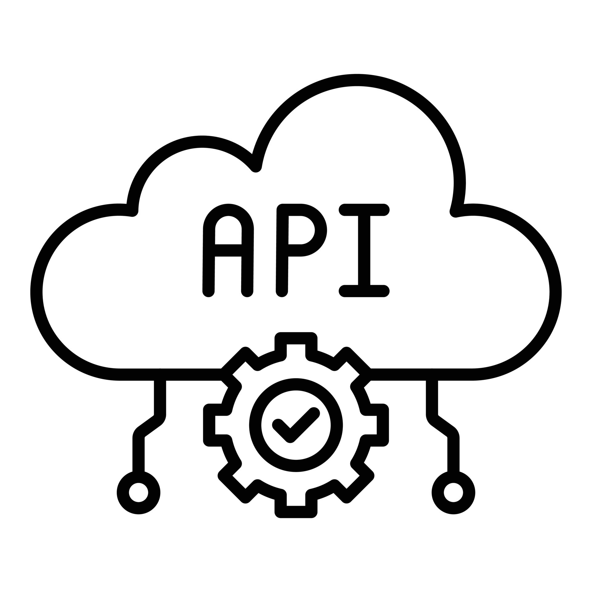

# Proyecto Integral N°3

El presente documento, es el **Proyecto Integral N°3** de ***Argentina Program 4.0***. Esta es una pequeña solución informática que sirve para acceder a un catálogo de peliculas o series.
La misma, fue diseñada y construida sobre una arquitectura API, la cual está desarrollada bajo las restricciones y recomendaciones de REST, ademas, implementa buenas prácticas de programación.

#### Especificaciones
- Servidor: http://127.0.0.1:3005
- Autor: Cristian Sigel
- Versión: 1.0.8

#### Requerimientos
- Node.js v18.16.1
- MySQL Workbench v8.0.34
- GIT v2.40.1
- IDE - Visual Studio Code v1.78.2

#### Estructura de directorios
``` tree
    ├── archivosql
    |   └── Creacion-BD-Trailerflix.sql(incluye vista)   
    ├── node_modules
    ├── src
    |   ├──conection
    |   |  └── conection.js
    |   ├──models
    |   |  ├──actores.js
    |   |  ├──categoria.js
    |   |  ├──contenido_actores.js
    |   |  ├──contenido_genero.js
    |   |  ├──contenido.js
    |   |  ├──generos.js
    |   |  ├──index.js
    |   |  ├──resumen.js
    |   |  ├──titulo.js
    │   |  └── vista_tipo_json.js
    |   ├──router
    |   |  ├──actores.js
    |   |  ├──categoria.js
    |   |  ├──contenido_vista.js
    |   |  ├──contenido.js
    |   |  ├──generos.js
    |   |  ├──resumen.js
    |   |  └──titulo.js
    │   └── server.js
    ├── .env
    ├── .env.dist
    ├── .eslintrc.json
    ├── .gitignore
    ├── package.json
    ├── package-lock.json 
    └── README.md
```

#### CONFIGURACIONES DE ENTORNO
#### VARIABLES DE ENTORNO
Se debe realizar una copia del archivo *.env.dist* y renombrarlo como *.env*, luego de esto asignarle los valores correspondiente a las variables:

- PORT=3005
- HOST=127.0.0.1

- DATABASE:trailerflix

- DBUSER=tu-usuario**Aqui colocar tu usuario**

- PASSWORD=tu-contraseña**Aqui colocar tu contraseña**

#### CONFIGURACION BASE DE DATOS
Se debe hacer correr en la base de datos el archivo *Creacion-BD-Trailerflix.sql* ya que el mismo contiene los datos de la BBDD y la vista utilizada para poder realizar los request.

- #### ERRORES & FORMATOS
La comprobación de errores y formatos se ejecuta por medio del comando ***npm run eslint***. se hace por medio de Eslint. Para visualizar los errores en tiempo de escritura, se debe tener instalada la extensión de **Eslint** en Visual Studio Code.

#### MÓDULO DE CONTENIDO
Este módulo permite gestionar el contenido, pudiendo leer sus registros además de visualizar reportes filtrados por diferentes criterios de búsqueda.

#### Métodos HTTP
| Tipo | URI | Descripción |
|------|-----|-------------|
| GET | http://127.0.0.1:3005/categoria | Nos muestra todas las categorias que existen |
| GET | http://127.0.0.1:3005/catalogo | Nos muestra el catálogo completo de la BBDD |
| GET | http://127.0.0.1:3005/catalogo/:id | Nos muestra un registro en específico(filtrado por ID) |
| GET | http://127.0.0.1:3005/catalogo/genero/:genero | Nos muestra el filtro por género |
| GET | http://127.0.0.1:3005/catalogo/categoria/:categoria | Nos muestra el filtro por categoria |
| GET | http://127.0.0.1:3005/actores | Nos muestra todos los actores que existen |
| GET | http://127.0.0.1:3005/actores/:nombre | Nos muestra todos los actores que coincida con los nombres que escribamos |
| GET | http://127.0.0.1:3005/generos | Nos muestra todos los generos que existen |
| GET | http://127.0.0.1:3005/genero/:genero | Nos muestra el filtro por género |
| GET | http://127.0.0.1:3005/resumen | Nos muestra el id, el nombre y resumen de todo nuestro contenido |
| GET | http://127.0.0.1:3005/resumen/:id | Nos muestra el id, el nombre y resumen de una busqueda en particular del resumen por id |
| GET | http://127.0.0.1:3005/titulos | Nos muestra todos los titulos que existen junto con su id correspondiente |
| GET | http://127.0.0.1:3005/titulos/:id | Nos muestra el id y el nombre de una busqueda en particular de los titulos por id |


#### Método GET:
- Request:

- Parámetros opcionales de tipo PARAMS:
/genero/Drama (tipo: string. Trae los titulos del genero filtrado)
/categoria/Serie (tipo: string. Trae los titulos de la categoria filtrada)
- Respuesta:

json
     {
      "id": 1,
      "poster": "http://127.0.0.1:3005/public/posters/1.jpg",
      "titulo": "The Crown",
      "categoria": "Serie",
      "genero": "Drama,Hechos Verídicos",
      "resumen": "Este drama narra las rivalidades políticas y el romance de la reina Isabel II, así como los sucesos que moldearon la segunda mitad del siglo XX.",
      "temporadas": "4",
      "reparto": "Claire Fox,Olivia Colman,Matt Smith,Tobias Menzies,Vanesa Kirby,Helena Bonham Carter",
      "trailer": null
     }

- Código HTTP: 200 Devuelve el título o títulos filtrados

- Código HTTP: 400 Message: No se encontraron resultados

- Código HTTP: 500 Message: Error al procesar la consulta


#### Método GET - Específico:
- Request:

- Parámetro obligatorio de tipo URL:
18 (tipo: integer. Indica el código del catalogo que se requiere obtener)
- Respuesta:

json
     {
      "id": 18,
  "poster": "http://127.0.0.1:3005/public/posters/18.jpg",
  "titulo": "Ava",
  "categoria": "Pelicula",
  "genero": "Acción,Drama,Suspenso",
  "resumen": "Ava es una mortífera asesina a sueldo que trabaja para una organización de operaciones encubiertas, que viaja por todo el mundo acabando con aquellos objetivos que nadie más puede derribar. Cuando uno de sus encargos sale mal, Ava tendrá que luchar por una vida.",
  "temporadas": "N/A",
  "reparto": "Jessica Chastain,John Malkovich,Collin Farrell,Common,Geena Davis,Ioan Gruffudd",
  "trailer": null
}

-Código HTTP: 200 Devuelve el título seleccionado

-Código HTTP: 400 Message: No se encontraron resultados para este ID

-Código HTTP: 500 Message: Error al procesar la consulta.